# Daily Levels: Focus Timer

[](https://github.com/sonnymay/daily-levels/actions/workflows/ci.yml)
[](https://swift.org)
[](https://developer.apple.com/swiftui/)
[](https://apps.apple.com/app/id6780007939)
[](LICENSE)

**Every 5 minutes of focus levels up your hero. Lock your phone — the hero keeps grinding. Resets at midnight.**

A calm, minimal focus timer with light-RPG visuals as motivation — not a game. One screen, one button. Native SwiftUI with **zero third-party dependencies**; everything stays on device.

**[Download on the App Store →](https://apps.apple.com/app/id6780007939)**

---

## Screenshots

| | | |
|:---:|:---:|:---:|
| 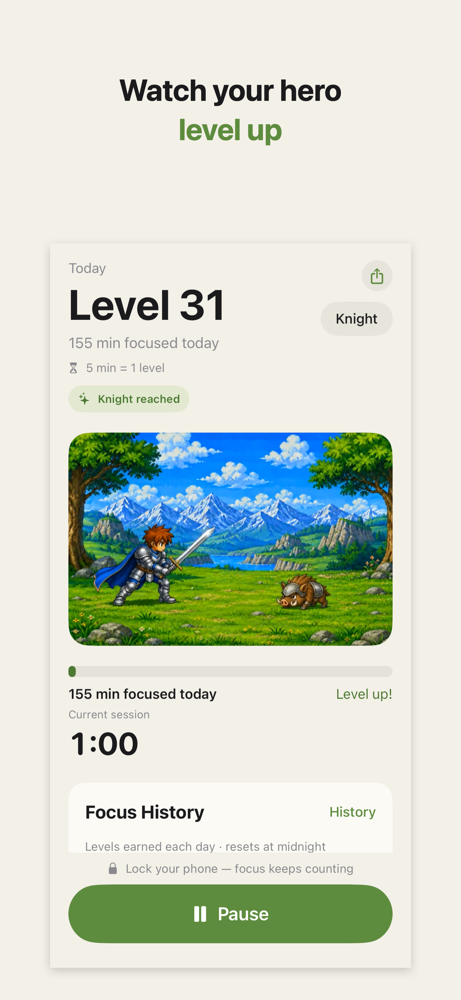 | 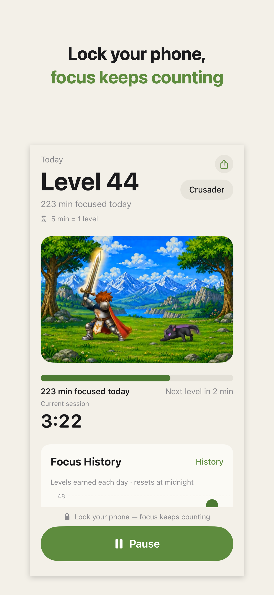 | 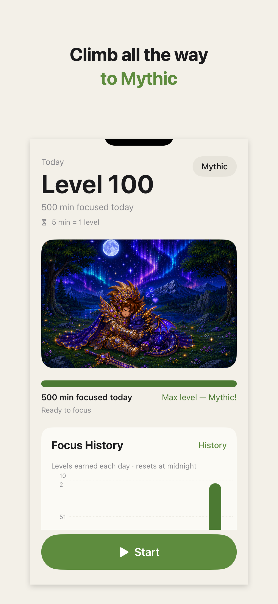 |
| Watch your hero level up | Lock your phone — focus keeps counting | Climb all the way to Mythic |
| 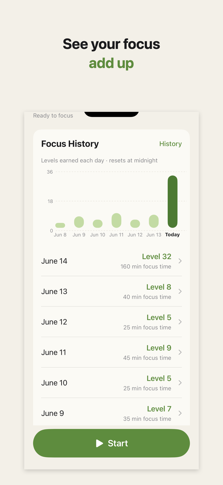 | 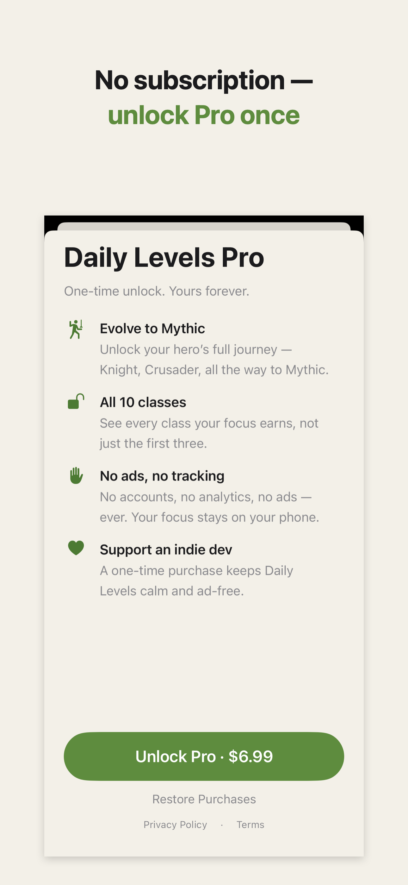 | 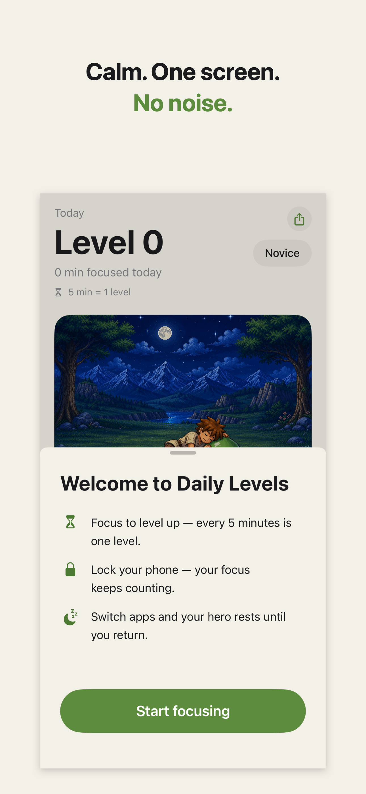 |
| See your focus add up | No subscription — unlock Pro once | Calm. One screen. No noise. |

---

## How It Works

```
5 minutes of focus = 1 level
Daily level = min(100, floor(todayFocusMinutes / 5))
Resets at midnight (local time) · Cap = Level 100 = 8h 20m
```

**Grinding** (hero fights & walks) — the timer counts when:
- The app is in the foreground
- The phone is **locked** ✅ ← living your life counts

**Sleeping** (hero rests by the campfire) — the timer pauses when:
- You switch to another app ← doomscrolling doesn't count
- You tap Pause

**Hero journey level** — the sum of every day's level, ever. It never resets, and it fills the Hero Collection one class at a time.

---

## The Daily Class Ladder

Every day starts fresh: everyone wakes up a Novice. Your class is a badge for *today's* effort.

| Class | Daily Level | Focus Time | Screenshot |
|:---:|:---:|:---:|:---:|
| **Novice** | 1–10 | up to 50 min | 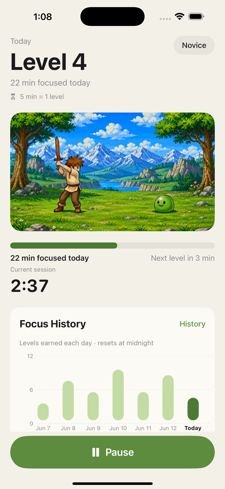 |
| **Squire** | 11–20 | ~1–1.7 hrs | 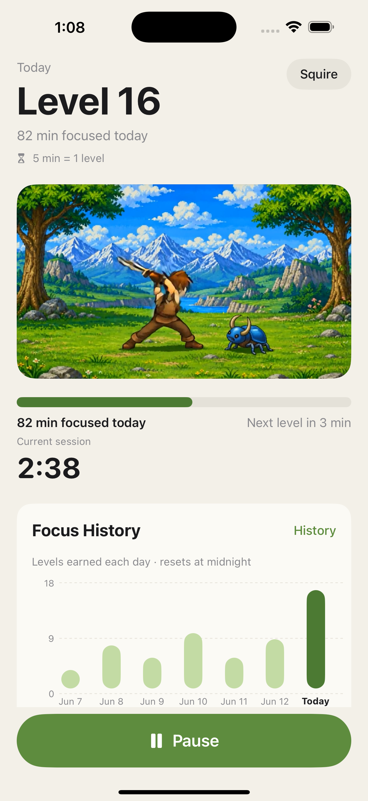 |
| **Swordsman** | 21–30 | ~1.7–2.5 hrs | 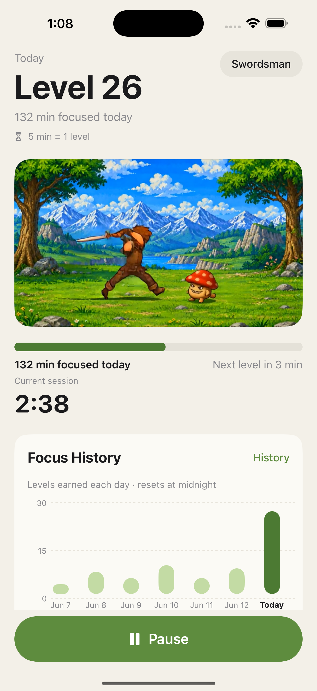 |
| **Knight** ⚔️ | 31–40 | ~2.6–3.3 hrs | 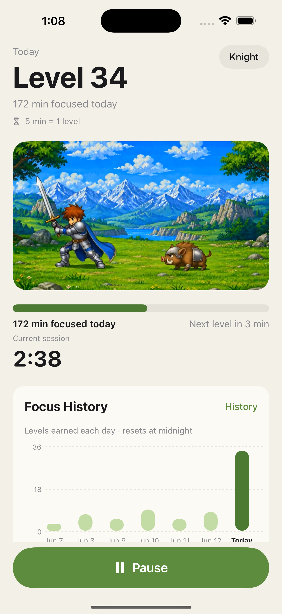 |
| **Crusader** | 41–50 | ~3.4–4.2 hrs | 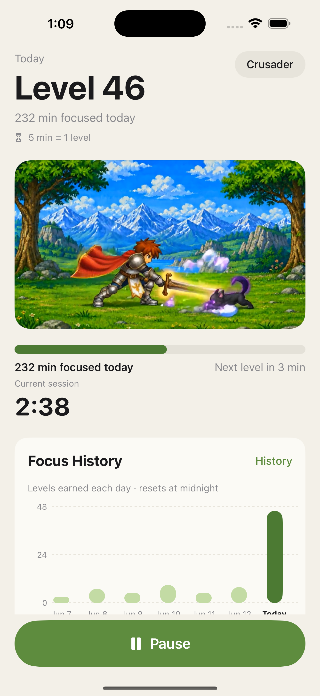 |
| **Champion** | 51–60 | ~4.2–5 hrs | 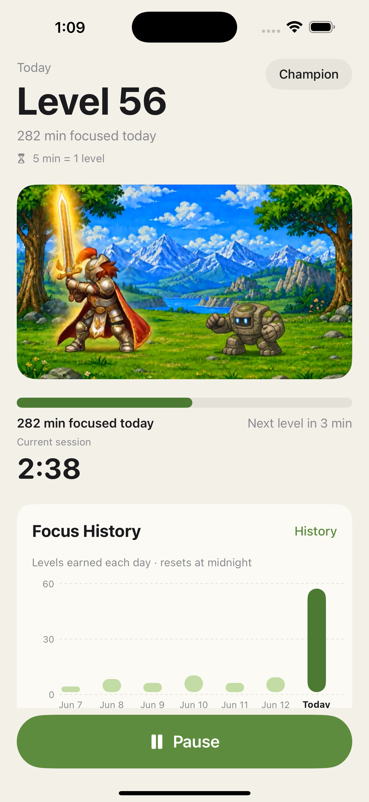 |
| **Paladin** | 61–70 | ~5–5.8 hrs | 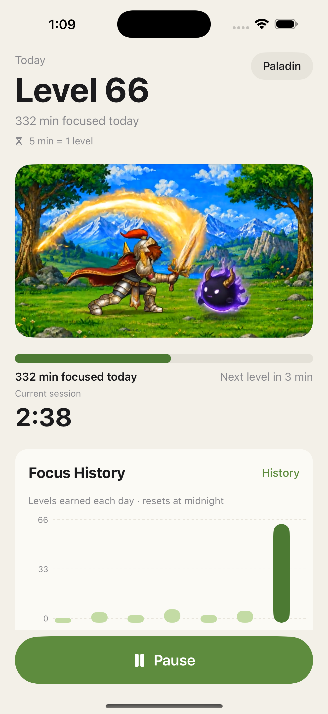 |
| **Hero** | 71–80 | ~5.9–6.7 hrs | 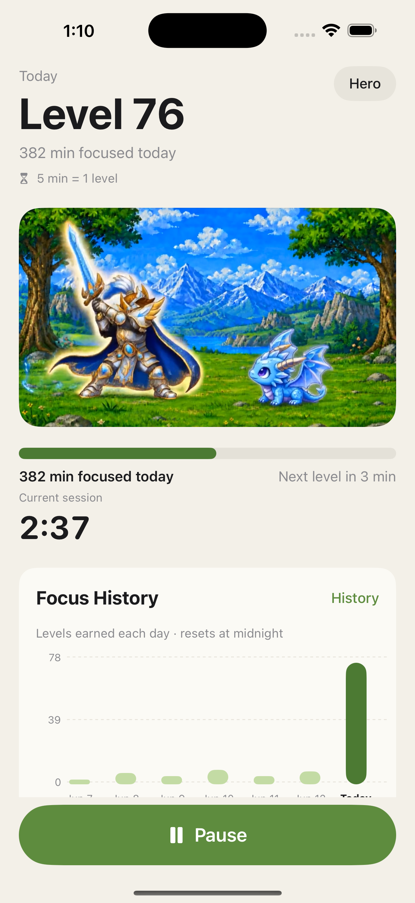 |
| **Legend** | 81–90 | ~6.8–7.5 hrs | 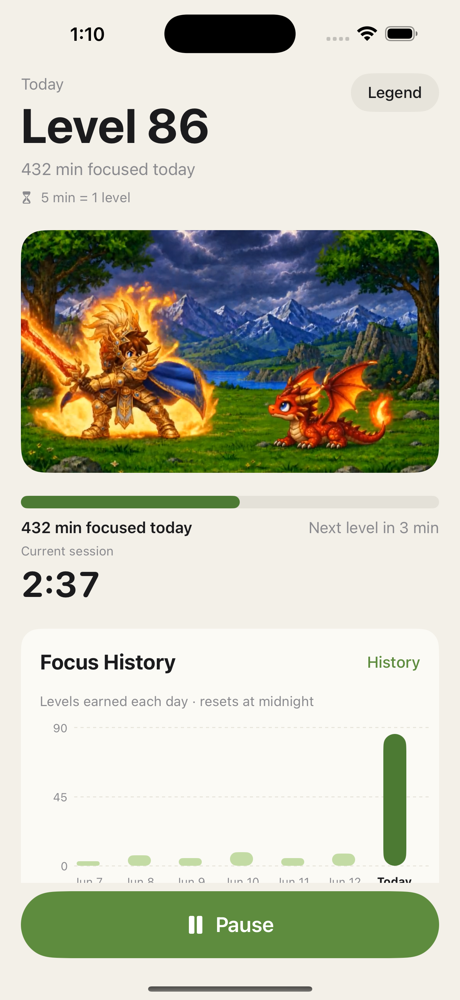 |
| **Mythic** 🏆 | 91–100 | ~7.6–8h20m | 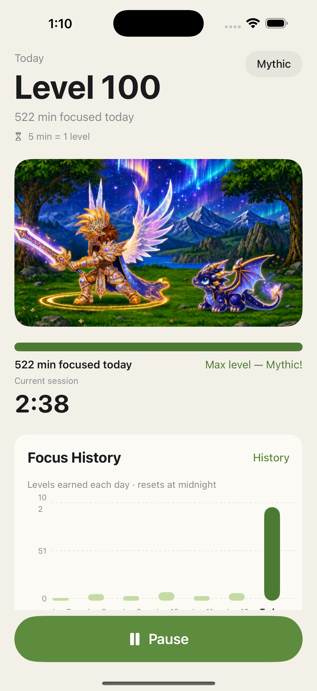 |

> Knight (Level 31 · ~2.6 hrs) is the aspirational everyday milestone. Mythic (Level 100 · 8h 20m) is the once-in-a-blue-moon flex worth screenshotting.

---

## Engineering Highlights

The parts of this codebase worth reading:

- **Lock vs. app-switch detection** — iOS reports "backgrounded" identically whether the user locked the phone or switched apps, but only a real lock (on a passcode device) fires `protectedDataWillBecomeUnavailable`. [`LockClassifier.swift`](DailyLevels/LockClassifier.swift) holds a `beginBackgroundTask` + 30-second grace window to tell the two apart, and is deliberately isolated in one swappable file. This one distinction is the product: locked = keep grinding, app switch = hero sleeps.
- **Pure, tested core** — level math, midnight session-splitting, and the per-day focus ledger are pure functions ([`LevelMath`](DailyLevels/LevelMath.swift), [`DateUtils`](DailyLevels/DateUtils.swift), [`FocusLedger`](DailyLevels/FocusLedger.swift)) covered by **52 XCTest unit tests**, including trust audits for DST transitions, timezone changes, lock classification, foreground transitions, and cold-launch crash recovery ([`TrustAuditTests`](DailyLevelsTests/TrustAuditTests.swift), [`FocusEngineTransitionTests`](DailyLevelsTests/FocusEngineTransitionTests.swift)).
- **Modern iOS 17 patterns** — `@Observable` + `@Environment` (no `ObservableObject` boilerplate) and SwiftData `@Model`. [`FocusEngine`](DailyLevels/FocusEngine.swift) is the single source of truth for focus state, level, class, progress, and history.
- **StoreKit 2, no middleman** — non-consumable Pro unlock with on-device transaction verification and Restore Purchases ([`Store.swift`](DailyLevels/Store.swift)). Skipping RevenueCat keeps the App Store privacy label at **Data Not Collected**. The screenshot/testing backdoor (`-unlockPro`) is compiled out of Release builds.
- **Conversion-driven redesign** — the original Pro gate keyed off the *daily* level, which resets at midnight, so ~95% of users could never see the paid art (Knight = 2.6 focused hours in a single day). The [Hero Collection](DailyLevels/Views/HeroCollectionView.swift) fixes it: all 10 heroes are visible from day one and fill up with the cumulative journey level, so Pro classes become something users can *see coming* within a week.
- **Localization with guardrails** — a String Catalog covers 6 languages (EN, ES, PT-BR, DE, FR, JA). `KnightClass.displayName` localizes while `rawValue` stays English (it drives asset filenames and Pro gating), pinned by [`LocalizationStabilityTests`](DailyLevelsTests/LocalizationStabilityTests.swift).
- **Hand-rolled where it counts** — gapless hero animation via an AVFoundation looping player ([`LoopingVideoView`](DailyLevels/Views/LoopingVideoView.swift)); 10 compact per-class clips; and a lightweight custom history chart with no charting dependency.

---

## Features

- **One screen, one button** — Start / Pause. Nothing else.
- **Lock detection** — phone locked = still grinding; another app = sleeping.
- **10-class daily ladder** — Novice → Mythic, fresh every midnight.
- **Hero Collection** — a lifetime journey level that never resets fills a 10-hero gallery.
- **7-day focus history** — a soft bar chart and simple day list, with no streak pressure.
- **Free + one-time Pro unlock** — no subscription (StoreKit 2).
- **No account, no tracking** — everything on device (SwiftData); privacy label: Data Not Collected.
- **Localized** — English, Spanish, Portuguese (BR), German, French, Japanese.
- **Accessible by design** — VoiceOver summaries, Dynamic Type, and Reduce Motion support.

---

## Project Structure

```
DailyLevels/
├── LevelMath.swift            # pure: level = floor(minutes / 5)        ← unit-tested
├── KnightClass.swift          # pure: 10-class ladder + localized names ← unit-tested
├── DateUtils.swift            # pure: split sessions at midnight        ← unit-tested
├── FocusLedger.swift          # pure: per-day seconds aggregation       ← unit-tested
├── Models.swift               # SwiftData @Model FocusSession + DaySummary
├── LockClassifier.swift       # lock vs. app-switch — isolated & swappable
├── FocusEngine.swift          # @Observable single source of truth
├── Store.swift                # StoreKit 2 Pro unlock entitlement
├── Haptics.swift · Theme.swift
├── Localizable.xcstrings      # String Catalog · 6 languages
└── Views/                     # MainView, HeroScenePanel, PaywallView,
                               # HeroCollectionView, FocusHistoryCard, …
DailyLevelsTests/              # 52 unit tests (math, midnight, i18n, trust audits)
AppStore/                      # metadata, ASO copy, screenshots, growth playbook
SPEC.md                        # full product spec — the source of truth
```

---

## Build · Test · Run

```bash
git clone https://github.com/sonnymay/daily-levels.git
cd daily-levels
open DailyLevels.xcodeproj                 # Xcode 16+, iOS 17.0+
```

Or from the command line:

```bash
xcodebuild -project DailyLevels.xcodeproj -scheme DailyLevels \
  -destination 'platform=iOS Simulator,name=iPhone 16' build test
```

- **Lock detection needs a physical iPhone with a passcode** — the simulator never fires `protectedDataWillBecomeUnavailable`.
- **IAP testing** uses the bundled StoreKit configuration (`DailyLevels.storekit`) — no sandbox account needed. Run from Xcode so the scheme's StoreKit config applies.
- **DEBUG launch arguments** for screenshots/demos: `-seedDemoData -autoStart -todayMinutes N -unlockPro`.

---

## App Store

| | |
|---|---|
| **Title** | Daily Levels: Focus Timer |
| **Category** | Productivity |
| **Link** | [apps.apple.com/app/id6780007939](https://apps.apple.com/app/id6780007939) |
| **Pricing** | Launched paid; moving to **free + one-time Pro unlock** (the freemium build in this repo) |
| **Privacy** | Data Not Collected |
| **Bundle ID** | `com.santipapmay.DailyLevels` |

---

## License

[Source-available](LICENSE) — read it, learn from it, build it locally. Redistribution, App Store republishing, and commercial use of the code, artwork, or name are reserved.
